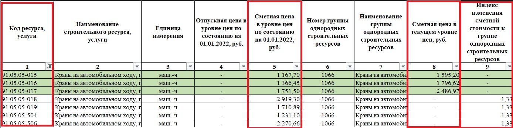
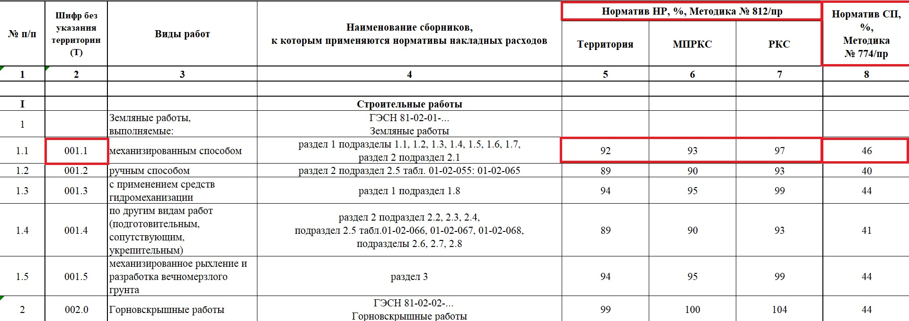
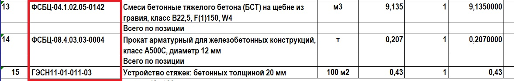

# ГЕНЕРАТОР СМЕТ В EXCEL

## Общая логика работы

```
Входные данные
    ↓
Парсинг нормативов (XML ГЭСН)
    ↓
Цены и классификация ресурсов (сплит-форма, ФСБЦ_Маш.xml, ФСБЦ_Мат&Оборуд.xml)
    ↓
Расчёт (коэффициенты, индексы, суммы)
    ↓
Формирование структуры сметы
    ↓
Экспорт в Excel
```
## Используемые файлы с данными

* **ГЭСН/ГЭСН`{любой постфикс}`.xml** - файлы ГЭСН

* **Сплит-форма `{город / республика}` на `{квартал}` `{год}`.xlsx** - содержит все расценки в базисном и текущем уровне с индексами пересчёта

* **ФСБЦ_Маш.xml и ФСБЦ_Мат&Оборуд.xml** - расценки + дополнительная информация (расценки удобнее из сплит-формы, доп.информация <u>важна</u>)

* **ФСНБ-`{год}` Привязка НР (812_пр) и СП (774_пр) ФСНБ-`{год}` Доп.`{номер}`.xlsx** - привязка накладных расходов и сметной прибыли к определенному ГЭСН. Содержится только в этом файле

### ! ВСЯ ИНФОРМАЦИЯ СКАЧИВАЕТСЯ С САЙТА ФГИС_ЦС !

---

## Структура

### 1. `classes.py` — здесь собраны классы для создания объектов сметы

Основные сущности:

* **Estimate** — вся смета (корневой объект)

* **Section** — раздел

* **WorkItem** — позиция (сам ГЭСН) и подготовленные поля

* **Resource** — конкретный ресурс, а именно:
  - то есть труд рабочих (в смете позиция **1. ОТ(ЗТ)**)

  - машины (в смете позиция **2. ОТ(ЗТ)**)

  - труд машинистов (в смете позиция **ОТм(ЗТм)**, прикрепляется к каждой машине)

  - материалы (в смете позиция **4. М**)

  ```python
  class ResourceType(Enum):
    """Типы ресурсов"""
    LABOR = "OT"           # Оплата труда рабочих (ЗТ)
    EQUIPMENT = "EM"       # Эксплуатация машин
    LABOR_OPERATOR = "OTm" # Оплата труда машинистов (ЗТм)
    MATERIAL = "M"         # Материалы
  ```

* **AbstractResource** — для ресурсов из ФСБЦ (**ЕСТЬ ПРОБЛЕМА! ПОЯСНЕНИЕ В РАЗДЕЛЕ: [ПРОБЛЕМЫ ТЕКУЩЕЙ РЕАЛИЗАЦИИ](#проблемы-текущей-реализации)**)

    ```python
    @dataclass
    class AbstractResource:
        """Абстрактный ресурс из ГЭСН (бетон, арматура, опалубка)"""
        code: str                    # "04.1.02.05"
        name: str                    # "ФСБЦ-Смеси бетонные тяжелого бетона"
        unit: str                    # "м3"
        quantity: Decimal            # 1.015
        technology_groups: str = ""  # "17.01.022"
    ```

* **Coefficient** — коэффициенты

    ```python
    @dataclass
    class Coefficient:
        """Коэффициент к расценке (421/пр и др.)"""
        code: str                    # "421/пр_2020_прил.10_т.5_п.3_гр.3"
        description: str             # Полное описание условия
        values: Dict[str, Decimal]   # {"ОЗП": 1.15, "ЭМ": 1.15, "ТЗ": 1.15}
    ```

* **EstimateMetadata** — шапка сметы

---

### 2. `norm_parser.py` — парсер ГЭСН

Что делает:

* находит норму по коду (например, `ГЭСН06-01-004-04`)

* отдельно смотрит префикс (`ГЭСН, ГЭСНр, ГЭСНп`), выбирает правильный файл

* дальше по коду (`06-01-004-04`) извлекает:
  * наименование
  * ресурсы
  * ФСБЦ-ресурсы
  * ссылки на НР/СП (накладные расходы / сметная прибыль)
* определяет тип ресурса (материал / машина / труд)

* подтягивает цены

* создаёт `WorkItem`

**Пример нормы из XML**:

```xml
<Work Code="06-01-004-04" EndName="железобетонных ступеней" MeasureUnit="м3">
    <Content>
        ...
    </Content>
    <Resources>
    <Resource Code="1-100-30" EndName="Средний разряд работы 3,0" Quantity="12.4" />
    <Resource Code="2" Quantity="0.20" />
    <Resource Code="91.05.05-015" EndName="Краны на автомобильном ходу, грузоподъемность 16 т" Quantity="0.01" />
    <Resource Code="91.07.04-001" EndName="Вибраторы глубинные" Quantity="2.28" />
    <Resource Code="91.07.04-002" EndName="Вибраторы поверхностные" Quantity="2.28" />
    <Resource Code="91.14.02-001" EndName="Автомобили бортовые, грузоподъемность до 5 т" Quantity="0.19" />
    <Resource Code="01.7.03.01-0001" EndName="Вода" MeasureUnit="м3" Quantity="0.0055" />
    <Resource Code="01.7.12.05-0053" EndName="Геополотно..." MeasureUnit="м2" Quantity="0.151" />
    <Resource Code="08.3.03.06-0001" EndName="Проволока вязальная" MeasureUnit="кг" Quantity="0.3" />
    <Resource Code="11.1.03.01-0063" EndName="Бруски обрезные..." MeasureUnit="м3" Quantity="0.02" />
    <Resource Code="11.1.03.06-0079" EndName="Доска обрезная..." MeasureUnit="м3" Quantity="0.38" />
    <AbstractResource Code="01.7.16.04" Name="Опалубка инвентарная (амортизация)" MeasureUnit="компл" Quantity="П" TechnologyGroups="30.01.007" />
    <AbstractResource Code="04.1.02.05" Name="Смеси бетонные тяжелого бетона" MeasureUnit="м3" Quantity="1.015" TechnologyGroups="17.01.022" />
    <AbstractResource Code="08.4.03.03" Name="Заготовки арматурные" MeasureUnit="т" Quantity="0.023" TechnologyGroups="13.06.005" />
    </Resources>
    <NrSp>
        <ReasonItem Nr="Пр/812-006.0" Sp="Пр/774-006.0" />
    </NrSp>
</Work>
```

**Созданный WorkItem**:

```python
<WorkItem(
    row_num=0,
    code='ГЭСН06-01-004-04',
    name='Устройство бетонных стен',
    unit='100 м3',
    quantity=Decimal('9'), #объём работ
    resources=[<Resource...>, <Resource...>],
    coefficients=[<Coefficient...>, <Coefficient...>],
    direct_costs=Decimal('1250000'),
    fot=Decimal('827000'),
    position_total=Decimal('2488433')
)>
```
---

### 3. `price_parser.py` — цены ресурсов

Работает со сплит-формой

Функции:

* поиск по коду ресурса
* извлечение:

  * базисной цены
  * текущей цены
  * индекса

**Возвращает в итоге:**

```python
# УСПЕШНЫЙ ПОИСК - возвращает dict
{
    'base_price': 4520.5,      # float - базисная цена
    'current_price': 4850.75,  # float - текущая цена
    'index': 1.073             # float - индекс пересчёта (нужен для перевода)
}

# или частичный словарь (если какие-то данные отсутствуют)
{
    'base_price': 4520.5,
    'index': 1.073
    # current_price отсутствует
}

# РЕСУРС НЕ НАЙДЕН - возвращает None
None
```

**Скриншот сплит-формы для примера (нас интересуют красные колонки):**



---

### 4. `resource_classifier.py` — классификация ресурсов

Определяет тип ресурса:

* машина
* материал
* труд

**Смотрим, как это происходит в структуре XML-файла ГЭСН на примере ГЭСН06-01-004-04**:

```xml
<Work Code="06-01-004-04" EndName="железобетонных ступеней" MeasureUnit="м3">
    <Content>
        ...
    </Content>
    <Resources>
    <Resource Code="1-100-30" EndName="Средний разряд работы 3,0" Quantity="12.4" />
    <Resource Code="2" Quantity="0.20" />
    <Resource Code="91.05.05-015" EndName="Краны на автомобильном ходу, грузоподъемность 16 т" Quantity="0.01" />
    <Resource Code="91.07.04-001" EndName="Вибраторы глубинные" Quantity="2.28" />
    <Resource Code="91.07.04-002" EndName="Вибраторы поверхностные" Quantity="2.28" />
    <Resource Code="91.14.02-001" EndName="Автомобили бортовые, грузоподъемность до 5 т" Quantity="0.19" />
    <Resource Code="01.7.03.01-0001" EndName="Вода" MeasureUnit="м3" Quantity="0.0055" />
    <Resource Code="01.7.12.05-0053" EndName="Геополотно..." MeasureUnit="м2" Quantity="0.151" />
    <Resource Code="08.3.03.06-0001" EndName="Проволока вязальная" MeasureUnit="кг" Quantity="0.3" />
    <Resource Code="11.1.03.01-0063" EndName="Бруски обрезные..." MeasureUnit="м3" Quantity="0.02" />
    <Resource Code="11.1.03.06-0079" EndName="Доска обрезная..." MeasureUnit="м3" Quantity="0.38" />
    <AbstractResource Code="01.7.16.04" Name="Опалубка инвентарная (амортизация)" MeasureUnit="компл" Quantity="П" TechnologyGroups="30.01.007" />
    <AbstractResource Code="04.1.02.05" Name="Смеси бетонные тяжелого бетона" MeasureUnit="м3" Quantity="1.015" TechnologyGroups="17.01.022" />
    <AbstractResource Code="08.4.03.03" Name="Заготовки арматурные" MeasureUnit="т" Quantity="0.023" TechnologyGroups="13.06.005" />
    </Resources>
    <NrSp>
        <ReasonItem Nr="Пр/812-006.0" Sp="Пр/774-006.0" />
    </NrSp>
</Work>
```

**Берем код ресурса (`Code="11.1.03.01-0063`) и ищем его в двух файлах - ФСБЦ_Маш.xml и ФСБЦ_Мат&Оборуд.xml:**

_(такой поиск нужен, потому что нет четкой привязки определенного кода к категориям ресурсов. Лучше проверять целиком, чтобы избежать ошибок с назначением)_

```xml
<Resource Code="11.1.03.01-0063" Name="Бруски обрезные хвойных пород (ель, сосна), естественной влажности, длина 2-6,5 м, ширина 20-90 мм, толщина 20-90 мм, сорт III" MeasureUnit="м3">
    <Prices>
        <Price Cost="16496.03" OptCost="15833.33" />
    </Prices>
</Resource>
```

_Приписываем ресурс к разделу **4. М** (материалы) и ищем расценки в сплит-форме_


**Берем код ресурса (`Code="91.05.05-015"`) и ищем его в двух файлах - ФСБЦ_Маш.xml и ФСБЦ_Мат&Оборуд.xml:**

_(ВАЖНО! Если это код машины, то для сметы обязательно нужен код машиниста и его категория (по ним ищется расценка в сплит-форме). Связка данных машина -> машинист присутствует ТОЛЬКО в этом файле)_

```xml
<Resource Code="91.05.05-015" Name="Краны на автомобильном ходу, грузоподъемность 16 т" MeasureUnit="маш.-ч">
    <Prices>
        <Price SalaryMach="451.93" LabourMach="1.00" PriceCostWithoutSalary="1167.70" WithRelocation="true" DriverCode="4-100-060" MachinistCategory="6.0" />
    </Prices>
    ...
</Resource>
```

_Приписываем ресурс к разделу **2. ЭМ** (машины) и **ОТм(ЗТм)** (труд машинистов) и ищем расценки в сплит-форме_

**Если в файлах кода нет (`Code="1-100-30"`), приписываем ресурс к разделу 1. ОТ(ЗТ)**

---

### 5. `normative_rates_parser.py` — НР и СП

(**НУЖНО ДОБАВИТЬ! ПОЯСНЕНИЕ В РАЗДЕЛЕ: [НУЖНО ДОБАВИТЬ](#нужно-добавить)**)

Парсит Excel с нормативами:

* накладные расходы (НР)
* сметная прибыль (СП)

```python
@dataclass
class OverheadRate:
    """Норматив НР для разных регионов"""
    code: str
    name: str
    territory: Decimal   # Для территории РФ
    mprks: Decimal       # Для районов Крайнего Севера
    rks: Decimal         # Для приравненных к Крайнему Северу

@dataclass
class ProfitRate:
    """Норматив СП"""
    code: str
    name: str
    percent: Decimal
```

**Загружаем Excel-файл, он в единственном экземпляре хранится по ссылке: [Рекомендуемая привязка НР и СП](https://fgiscs.minstroyrf.ru/frsn/reference/letters/ee96f3a2-051d-4d75-b97e-af7e4c1b91ac#ee96f3a2-051d-4d75-b97e-af7e4c1b91ac)**

**Она лежит в разделе: _сайт ФГИС ЦС_, _Федеральный реест сметных нормативов_, _Иные документы_**

**Выглядит так:**


**Ищем подходящие НР и СП по тегу в XML-файле ГЭСН (очень удобно). В файле это код во второй колонке:**

```xml
<NrSp>
    <ReasonItem Nr="Пр/812-006.0" Sp="Пр/774-006.0" />
</NrSp>
```
---

### 6. `calculator.py` — расчёт сметы

Для каждого ресурса:

1. Применяет коэффициенты
2. Считает количество:

   ```
   quantity_total = норма × объём × коэффициенты
   ```
3. Считает цену:

   ```
   current_price = base_price × index
   ```
4. Считает стоимость:

   ```
   total_cost = quantity_total × current_price
   ```

**Вот в коде:**
```python
def _calculate_work_item(self, item: WorkItem) -> None:
    for res in item.resources:
        # 1. Применяет коэффициенты
        self._apply_coefficients_to_resource(res, item)

        # 2. Считает количество: норма × объём × коэффициенты
        res.quantity_total = res.quantity_per_unit * item.quantity * res.coefficient

        # 3. Считает цену: base_price × index
        self._calculate_current_price(res)

        # 4. Считает стоимость: quantity_total × current_price
        if res.current_price != Decimal("0"):
            res.total_cost = res.quantity_total * res.current_price
```

**Применение коэффцициентов:**
```python
def _apply_coefficients_to_resource(self, resource: Resource, item: WorkItem) -> None:
    """Применить коэффициенты из WorkItem к ресурсу"""
    total_coef = Decimal("1.0")

    for coef in item.coefficients:
        # К разделам, которые обычно указываются в описании коэффициента (например в 421/пр_2020_прил.10_т.5_п.3_гр.3)
        coef_key = {
            ResourceType.LABOR: "ТЗ",           # трудозатраты
            ResourceType.EQUIPMENT: "ЭМ",       # эксплуатация машин
            ResourceType.LABOR_OPERATOR: "ТЗМ", # трудозатраты машинистов
        }.get(resource.resource_type)

        if coef_key:
            total_coef *= coef.values.get(coef_key, Decimal("1.0"))

    resource.coefficient = total_coef
```

Для позиции:

* прямые затраты
* ФОТ

```python
def _calculate_work_item(self, item: WorkItem) -> None:
    fot_total = Decimal("0")
    direct_total = Decimal("0")

    for res in item.resources:
        # ... расчёт ресурса ...

        direct_total += res.total_cost

        # ФОТ = только трудовые ресурсы (рабочие + машинисты)
        if res.resource_type in (ResourceType.LABOR, ResourceType.LABOR_OPERATOR):
            fot_total += res.total_cost

    item.direct_costs = direct_total
    item.fot = fot_total
    item.position_total = direct_total
```

Для раздела (**НУЖНО ДОБАВИТЬ! ПОЯСНЕНИЕ В РАЗДЕЛЕ: [НУЖНО ДОБАВИТЬ](#нужно-добавить)**):

* итоги
* НР
* СП
* общая стоимость

```python
def calculate_section(self, section: Section) -> None:
    # Рассчитываем каждую позицию
    for item in section.items:
        self._calculate_work_item(item)

    # Собираем итоги по всему разделу
    direct_total = sum(item.direct_costs for item in section.items)
    fot_total = sum(item.fot for item in section.items)

    # Заполняем итоговые строки раздела
    for summary in section.summaries:
        if summary.row_type == RowType.SUBTOTAL_DIRECT:
            summary.total_cost = direct_total
        elif summary.row_type == RowType.SUBTOTAL_FOT:
            summary.total_cost = fot_total
        elif summary.row_type == RowType.OVERHEAD and summary.percentage:
            # НР = ФОТ × процент / 100
            summary.total_cost = fot_total * (summary.percentage / Decimal("100"))
        elif summary.row_type == RowType.PROFIT and summary.percentage:
            # СП = ФОТ × процент / 100
            summary.total_cost = fot_total * (summary.percentage / Decimal("100"))
        elif summary.row_type == RowType.POSITION_TOTAL:
            # Общая стоимость = прямые затраты + НР + СП
            overhead = next((s.total_cost for s in section.summaries
                            if s.row_type == RowType.OVERHEAD), Decimal("0"))
            profit = next((s.total_cost for s in section.summaries
                          if s.row_type == RowType.PROFIT), Decimal("0"))
            summary.total_cost = direct_total + overhead + profit
```

---

### 7. `export.py` — экспорт в Excel

Формирует итоговый файл сметы.

Структура:

* 1–25 строки → шапка
* 26–32 → сводные показатели
* далее → таблица

Включает:

* стили
* объединение ячеек
* нужный формат ФГИС ЦС

---
## Входные данные

**(! ВНИМАНИЕ ! ПОГОВОРИТЬ С ДАШЕЙ ПРО СВЯЗЬ ДЕФЕКТНОЙ ВЕДОМОСТИ И СМЕТЫ ПРИ ОПРЕДЕЛЕНИИ ОБЪЁМА РАБОТ)**

Пример:

```python
user_input = [
    {"code": "ГЭСН06-01-004-04", "quantity": Decimal("9")},
    {"code": "ГЭСН11-01-011-03", "quantity": Decimal("0.43")}
]
```

**Пока что подаются и коэффициенты, как появится агент, это уберём:**
```python
common_coefficients = [
        Coefficient(
            code="421/пр_2020_прил.10_т.5_п.3_гр.3",
            description="Производство ремонтно-строительных работ... ОЗП=1,15; ЭМ=1,15; ЗПМ=1,15; ТЗ=1,15; ТЗМ=1,15",
            values={"ОЗП": Decimal("1.15"), "ЭМ": Decimal("1.15"), "ЗПМ": Decimal("1.15"), "ТЗ": Decimal("1.15"), "ТЗМ": Decimal("1.15")},
        ),
        Coefficient(
            code="421/пр_2020_п.58_пп.б",
            description="При применении сметных норм... ОЗП=1,15; ЭМ=1,25; ЗПМ=1,25; ТЗ=1,15; ТЗМ=1,25",
            values={"ОЗП": Decimal("1.15"), "ЭМ": Decimal("1.25"), "ЗПМ": Decimal("1.25"), "ТЗ": Decimal("1.15"), "ТЗМ": Decimal("1.25")},
        ),
    ]
```

## ПРОБЛЕМЫ ТЕКУЩЕЙ РЕАЛИЗАЦИИ

**ГЛАВНАЯ ПРОБЛЕМА: дополнительные ресурсы (`AbstractResource`)**

**Вот как они содержатся в ГЭСН:**
```xml
<AbstractResource Code="01.7.16.04" Name="Опалубка инвентарная (амортизация)" MeasureUnit="компл" Quantity="П" TechnologyGroups="30.01.007" />
<AbstractResource Code="04.1.02.05" Name="Смеси бетонные тяжелого бетона" MeasureUnit="м3" Quantity="1.015" TechnologyGroups="17.01.022" />
<AbstractResource Code="08.4.03.03" Name="Заготовки арматурные" MeasureUnit="т" Quantity="0.023" TechnologyGroups="13.06.005" />
```

**А вот как в смете должны быть:**


**То есть в смете содержится УТОЧНЕННЫЙ КОД, а в XML - ОБЩИЙ. Сответственно цены парсятся неправильные. Файла для корректной связи пока НЕ НАШЛА**

---

## НУЖНО ДОБАВИТЬ

- **Общие итоги по разделу**

- **Обработку территории**
